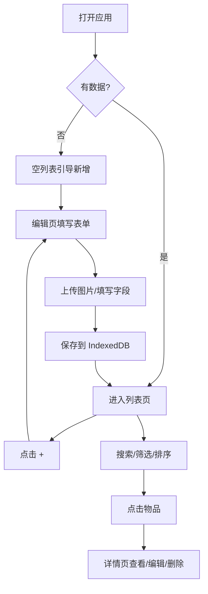

# 物品管理 Web 应用 - PRD

## 1. 产品概述

一个本地优先（Local-first）的物品清单管理 Web 应用，用于记录与查找日常物品。
- 核心目标：让用户随时（手机 / 桌面）记录物品并快速找回
- 目标用户：有较多杂物、工具、电子产品、收藏品等需要管理的个人用户
- 产品价值：减少"找不到东西"的时间，支持标签、分类、位置检索

## 2. 核心功能

### 2.1 用户角色
无登录体系，单用户本地使用（数据保存在浏览器本地）。

### 2.2 功能模块

1. **物品列表页**：物品卡片/列表展示、搜索、筛选、排序、分组切换
2. **物品详情页**：查看完整字段、图片轮播、编辑/删除入口
3. **物品编辑页**：新增或编辑物品，表单 + 图片上传
4. **分组/分类/标签管理**：分组、分类、标签的增删改
5. **统计页（轻量仪表板）**：数量统计、按分类/标签分布、最近添加
6. **设置页**：主题切换（亮/暗/跟随系统）、数据导入导出、清空

### 2.3 页面与功能详情

| 页面 | 模块 | 功能描述 |
|------|------|----------|
| 物品列表 | 顶部搜索栏 | 关键词模糊匹配名称、型号、标签、位置 |
| 物品列表 | 筛选器 | 按分组、分类、标签筛选 |
| 物品列表 | 排序 | 按添加时间、价格、数量、名称排序 |
| 物品列表 | 视图切换 | 卡片网格 / 紧凑列表（手机自适应） |
| 物品列表 | 分组导航 | 抽屉式分组列表（左/右侧滑出） |
| 物品详情 | 字段展示 | 名称、型号、价格、标签、分类、数量、位置、图片 |
| 物品详情 | 操作 | 编辑、删除、复制字段 |
| 物品编辑 | 表单 | 全部字段校验（名称必填，价格为数字，数量为整数） |
| 物品编辑 | 图片上传 | 多图上传，本地压缩与预览，限制 5 张 |
| 分组管理 | 列表 + 操作 | CRUD 分组，绑定默认分类 |
| 分类管理 | 列表 + 操作 | CRUD 分类（与分组解耦，分类为标签维度） |
| 标签管理 | 列表 + 操作 | CRUD 标签，标签输入支持自动补全 |
| 统计 | 总览卡片 | 总物品数、总价值、低库存提醒 |
| 统计 | 分布 | 按分类 / 标签饼图（纯 SVG 实现，无 AI 渐变） |
| 设置 | 主题 | 亮 / 暗 / 跟随系统切换 |
| 设置 | 数据 | 导出 JSON / 从 JSON 导入 / 清空全部 |

## 3. 核心流程

## 4. 用户界面设计

### 4.1 设计风格
- **主色**：纯黑 / 纯白为主，强调对比与排版而非彩色
- **辅色**：中性灰阶（4-6 级），单色警示色（琥珀色 `#A16207` 表示低库存）
- **绝对不使用**：紫色 / 蓝色 / 粉色等 AI 渐变配色
- **字体**：
  - 标题：Serif 字符感的衬线（如 `IBM Plex Serif` 或 `Noto Serif SC`）
  - 正文：等宽或几何无衬线（如 `JetBrains Mono` 用于数字、`Inter Tight` 或 `Geist` 用于正文；中文用 `Noto Sans SC`）
- **按钮**：直角或极小圆角（2-4px），1px 实线边框（亮色）或细描边（暗色）
- **布局**：留白克制；表格 / 卡片对齐网格；列表在手机端为单列
- **图标**：线性图标（Lucide / Phosphor / Tabler），统一 1.5px 描边

### 4.2 页面设计概览

| 页面 | 模块 | UI 元素 |
|------|------|---------|
| 列表 | 顶栏 | 黑底白字或白底黑字，左对齐标题"物品"，右侧 + 按钮（方形） |
| 列表 | 卡片 | 1px 边框，无阴影，图片 4:3 占位，标签用 #前缀 |
| 列表 | 抽屉 | 滑出式分组，侧边 80% 宽度，遮罩半透明黑 |
| 编辑 | 表单 | 字段之间 24px 间距，输入框无圆角，focus 状态变为下划线加粗 |
| 详情 | 图片 | 横向滚动 carousel，序号指示器为数字（非渐变） |
| 统计 | 数字 | 等宽字体（JetBrains Mono），表格化展示 |
| 设置 | 主题切换 | 三态 Segmented Control，无渐变 |

### 4.3 响应式
- **移动优先**：默认布局按 375px 宽度设计，再向上扩展
- 桌面端 ≥1024px：列表改为多列网格（auto-fill，最小 280px），顶部改为横向导航
- 触控优化：所有可点击区域 ≥44x44px，列表使用整行点击 + 右侧操作

### 4.4 主题
- 浅色：背景 `#FAFAFA`，前景 `#0A0A0A`，边框 `#E5E5E5`
- 深色：背景 `#0A0A0A`，前景 `#FAFAFA`，边框 `#262626`
- 切换：CSS 变量驱动，存储于 `localStorage`，支持 `prefers-color-scheme`
- 转换动画：仅颜色和背景 200ms ease 过渡，不使用渐变
