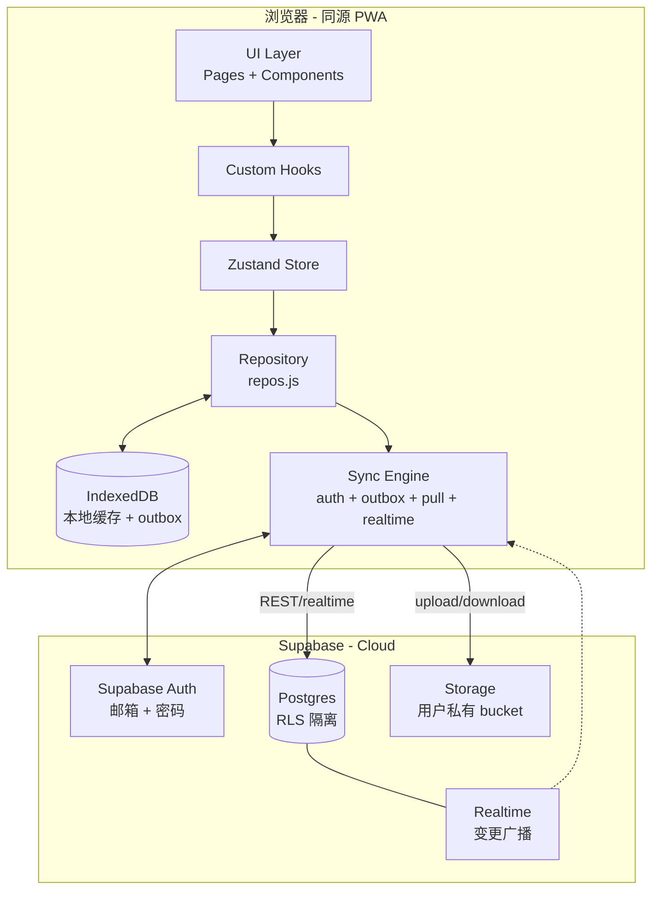

# 物品管理应用 — 云端同步方案设计（v1）

> 适用项目：Where Is It? — Local-first 私人物品账本
> 目标：在不破坏现有 Local-first 体验与隐私模型的前提下，为多设备用户提供稳定、可见、可控的云同步能力。
> 决策日期：2026-07-24
> 状态：方案稿（待评审通过后进入实施）

---

## 0. TL;DR

- **后端**：Supabase（Postgres + Auth + Storage + Realtime 一站式，零运维，与项目体量匹配）。
- **数据模型**：将现有 7 张 IndexedDB 对象库一一映射到 Postgres 表 + 一张 `blobs` 走 Storage；列结构与现有 IndexedDB 字段保持一致，仅补充 `user_id`、`deleted_at`、`version`。
- **冲突**：Last-Write-Wins（按 `updated_at`），删除以软删除 + 30 天回收站实现。
- **同步触发**：写后实时增量推送（队列 + 去抖 + 退避重试）+ 启动/联网恢复时全量拉取 + Realtime 订阅下行变更。
- **账号**：邮箱 + 密码（Supabase Auth）。
- **离线**：保持原 IndexedDB 行为不变；同步是叠加层，本地始终是 source of truth，UI 永远先读本地。
- **存储成本**：图片默认压缩 ≤ 1 MB / 张，约定单账号 ≤ 1 GB 总量。

---

## 1. 同步边界与原则

### 1.1 同步什么（白名单）

| 现有 IndexedDB store | 同步策略 | 备注 |
| --- | --- | --- |
| `items` | 整行同步（含 `tagIds[]`） | 主数据 |
| `images` | 元数据同步；二进制走 Storage | 元数据极小 |
| `blobs` | 仅迁移到 Storage；IDB 中保留缓存 | 见 §6 |
| `groups` | 整行同步 | |
| `categories` | 整行同步 | |
| `tags` | 整行同步 | |
| `locations` | 整行同步 | |
| `localStorage`（偏好 / 主题 / 语言） | **不同步** | 设备本地偏好，不属于"数据" |
| Service Worker / 缓存 | **不同步** | |

### 1.2 不同步什么（黑名单）

- 用户偏好（主题、语言、视图模式、压缩阈值）— 设备本地
- 临时文件 / 草稿（若有）
- Service Worker 缓存

### 1.3 三条铁律

1. **本地永远是 source of truth**：写操作先落 IndexedDB，再异步 push；UI 只读 IDB，永不阻塞等待云端。
2. **离线优先 + 网络无关**：断网时所有写操作正常进行，登录态掉线时仍可读写（仅离线写继续累积到 outbox）。
3. **可逆**：用户能在设置中"退出登录并保留本地数据"或"登出并清空云端"——绝不让云端成为唯一副本。

---

## 2. 整体架构



数据流：
- **本地写**：Repository 先写 IDB → 同时 enqueue 一条 outbox 记录 → Sync Engine 拉到网络后批量推送。
- **本地读**：UI 永远从 IDB 读，不直连 Supabase。Cloud pull 写回 IDB 后通过 Zustand `refresh()` 让 UI 自动刷新。
- **云端变更下行**：Supabase Realtime 订阅 → Sync 引擎比对 last_pulled_at → 增量写回 IDB → refresh。

---

## 3. Supabase Schema 设计

### 3.1 表结构（与 IDB 字段一一对应）

所有表增加三列：`user_id uuid NOT NULL`（关联 `auth.users`）、`updated_at timestamptz`（触发器维护）、`deleted_at timestamptz`（软删，NULL 表示存活）。

```sql
-- 用户级隔离：通过 auth.uid() 在 RLS 中强制
alter database postgres set "app.settings.user_id_claim" = 'sub';

create table public.items (
  id text primary key,             -- 与 IDB 的 id 保持一致
  user_id uuid not null references auth.users(id) on delete cascade,
  name text not null,
  model text default '',
  price numeric default 0,
  quantity int default 0,
  group_id text default '',
  category_id text default '',
  tag_ids jsonb default '[]',      -- 数组；与 IDB 同语义
  location text default '',
  note text default '',
  image_ids jsonb default '[]',
  purchased_at text default '',
  created_at timestamptz not null,
  updated_at timestamptz not null default now(),
  deleted_at timestamptz
);
create index on public.items (user_id, updated_at desc);
create index on public.items (user_id, deleted_at);

create table public.images (
  id text primary key,
  user_id uuid not null references auth.users(id) on delete cascade,
  item_id text not null,
  blob_id text not null,           -- Storage 中的 object key
  "order" int default 0,
  created_at timestamptz not null default now(),
  updated_at timestamptz not null default now(),
  deleted_at timestamptz
);
create index on public.images (user_id, item_id);

create table public.blobs (
  id text primary key,             -- = Storage object name
  user_id uuid not null references auth.users(id) on delete cascade,
  mime text default 'image/jpeg',
  size int default 0,
  storage_path text not null,      -- bucket/path
  created_at timestamptz not null default now(),
  deleted_at timestamptz
);

create table public.groups (
  id text primary key, user_id uuid not null, name text, color text default '',
  "order" int default 0,
  created_at timestamptz not null, updated_at timestamptz not null default now(),
  deleted_at timestamptz
);
create table public.categories (
  id text primary key, user_id uuid not null, name text,
  created_at timestamptz not null, updated_at timestamptz not null default now(),
  deleted_at timestamptz
);
create table public.tags (
  id text primary key, user_id uuid not null, name text,
  created_at timestamptz not null, updated_at timestamptz not null default now(),
  deleted_at timestamptz
);
create table public.locations (
  id text primary key, user_id uuid not null, name text, use_count int default 0,
  "order" int default 0,
  created_at timestamptz not null, updated_at timestamptz not null default now(),
  deleted_at timestamptz
);

-- updated_at 触发器
create or replace function public.set_updated_at() returns trigger as $$
begin new.updated_at = now(); return new; end;
$$ language plpgsql;

create trigger trg_items_updated before update on public.items
for each row execute function public.set_updated_at();
-- 其他表同上
```

### 3.2 RLS（行级安全）

所有表强制 `user_id = auth.uid()`，只允许本人读写；同时允许软删（写 `deleted_at`）：

```sql
alter table public.items enable row level security;

create policy items_owner_all on public.items
  for all using (user_id = auth.uid()) with check (user_id = auth.uid());
-- images / blobs / groups / categories / tags / locations 同上
```

### 3.3 Storage

- 一个私有 bucket：`user-files`，路径约定 `{user_id}/{blob_id}.{ext}`。
- Storage RLS：用 `auth.uid()` 与 path 第一段比对。每个上传/下载前过 `getSession()`。
- 增量上传：复用 IDB 已有 blob，**不再额外压缩**（本地已经压到 ≤ maxImageBytes）；如需客户端直传可生成 signed URL。

---

## 4. 冲突解决（Last-Write-Wins）

### 4.1 字段不变性

- 每条记录保留 `updated_at`（毫秒精度 timestamptz）。
- 客户端产生更新时必须**单方向取大**：本地时钟与服务端时钟可能漂移，因此每次 push 前先读本地最新 `updated_at` 与服务端对应行 `updated_at` 比较。

### 4.2 Pull 合并算法（按 store 独立跑）

```
pullStore(storeName):
  cursor = getCursor(storeName, 'last_pulled_at')
  remote = supabase.from(store).select('*')
            .gt('updated_at', cursor)
            .eq('user_id', me.id)
            .order('updated_at', { ascending: true })
            .limit(500)
  for each r in remote:
    local = idb.get(store, r.id)
    if !local: idb.put(r)
    else if local.updated_at < r.updated_at: idb.put(r)   -- 远端更新
    else: skip  -- 本地更新或同时间，留给 outbox push 兜底
  cursor = max(cursor, r.updated_at)
  setCursor(storeName, cursor)
  翻页直到 remote.length == 0
```

### 4.3 Push 合并算法（写后增量）

```
pushItem(row):
  remote = supabase.from('items').select('updated_at').eq('id', row.id).maybeSingle()
  if remote && remote.updated_at > row.updated_at:
    return SKIP_LOCAL_OLDER   -- 本地陈旧，不要覆盖
  await supabase.from('items').upsert({ ...row, user_id: me.id })
  -- 写完后这条出 outbox
```

### 4.4 删除

- 删除走软删：写 `deleted_at = now()`，不传 0/1，避免误删恢复。
- 客户端 `remove()` 改为：本地写 `deleted_at` + 入 outbox；云端 delete 60 天后由定时任务硬删（Supabase Edge Function 每周跑一次）。
- 拉取时一并带 `deleted_at`，UI 在 `useCatalogStore` 里过滤；为保证浏览器本地有"回收站"语义，UI 增加「30 天内可恢复」抽屉（可选 v1.1）。

---

## 5. 前端 Sync 引擎

### 5.1 模块拆分（新增文件，全部在 `src/sync/`）

```
src/sync/
├── supabaseClient.js      # createClient(url, anonKey)，从 env 读
├── auth.js                # signIn / signUp / signOut / onAuthStateChange
├── outbox.js              # outbox 队列（IDB 一个 store）+ 序列化
├── pull.js                # 按 store 全量 + 增量拉取
├── push.js                # outbox 消费者，含去抖/重试
├── media.js               # 图片 upload/download，签名 URL 复用
├── realtime.js            # 订阅各表的变更（INSERT/UPDATE/DELETE）
├── syncStatus.js          # 单例 zustand slice：state / pending / lastSyncAt
└── schemaMap.js           # IDB ↔ Postgres 字段名映射（camelCase ↔ snake_case）
```

> 命名约定延续现有仓库风格：hooks `useXxx.js`、页面 `XxxPage.jsx`、仓库级 `src/lib/*`、`src/sync/*` 作为新的子模块。

### 5.2 Outbox 设计（核心）

在 IDB 新增一个对象库 `outbox`，schema 升级到 `DB_VERSION = 3`：

```js
{
  id: 'ob_<uuid>',          // 主键
  op: 'upsert' | 'delete',
  store: 'items',
  rowId: 'itm_xxx',
  // upsert 时把整行快照存这里，避免 push 还要再读 IDB
  payload: { ... },
  attempts: 0,              // 已重试次数
  lastError: null,
  createdAt: now(),
  nextAttemptAt: now(),
}
```

- 入队时机：`repos.js` 的 `create/update/remove` 末尾，各加一行 `_sync.outbox.enqueue(...)`。
- 出队时机：`push.js` 订阅 `online` / `auth` 两个事件 + 5s 心跳。

### 5.3 推送流程（伪代码）

```
on enqueue:
  schedule flushPush()       // 去抖 500ms 内合并多条相同 row 的写
  // 同一 row 多次 enqueue → 只保留最后一次 payload，避免过期覆盖

flushPush():
  online && authed || return
  rows = outbox.list(limit=50, order by createdAt)
  for row in rows:
    try {
      if row.op == 'upsert':
        await push.upsert(row.store, row.payload)
      else:
        await push.softDelete(row.store, row.rowId)
      outbox.ack(row.id)
    } catch (err) {
      if (err.isNetwork || err.code === 401) {
        outbox.retry(row.id, attempts+1, nextAttemptAt = backoff(...))
        return                       // 退避：1s, 3s, 9s, 30s, 最大 5 分钟
      }
      if (err.isConflict) {
        // 服务端 updated_at 更晚 → 本地陈旧；把这条 outbox 标 done（让 pull 来对齐）
        outbox.skip(row.id, reason='local_older')
      }
    }
```

指数退避：`min(2^attempts * 1000ms, 5*60*1000) + jitter(0..1000ms)`。

### 5.4 拉取流程

```
pullAll():
  for storeName of ['items','images','groups','categories','tags','locations']:
    await pullStore(storeName, { since: getCursor(store) })
  await useCatalogStore.getState().refresh()
```

触发时机：
1. 登录成功后立即全量一次。
2. 应用启动（`main.jsx`）时若已登录且有网，跑一次。
3. Realtime 接收到任意表的写入事件，跑一次（lightweight，仅查 cursor 之后）。
4. 用户手动点「立即同步」按钮。

### 5.5 Realtime

```js
supabase.channel('wist-sync')
  .on('postgres_changes',
      { event: '*', schema: 'public', table: 'items' },
      onChange('items'))
  .on('postgres_changes', { event: '*', schema: 'public', table: 'images' }, onChange('images'))
  // 其他表同理
  .subscribe()
```

`onChange` 内仅把受影响行写入本地 outbox-pull 队列（同前面 pull 的合并算法），不直接写 IDB——避免插队。

### 5.6 与现有 `useCatalogStore` 协作

`useCatalogStore.refresh()` 已经把 IDB 的数据塞进 Zustand；sync 引擎不直接接触 store，**写完 IDB 后调用 `refresh()`**，UI 自然刷新。这样 Store 仍是单一渲染数据源。

### 5.7 Schema 字段映射

```js
// schemaMap.js
export const ITEM_FIELDS = {
  id: 'id',
  name: 'name',
  model: 'model',
  price: 'price',
  quantity: 'quantity',
  groupId: 'group_id',
  categoryId: 'category_id',
  tagIds: 'tag_ids',
  location: 'location',
  note: 'note',
  imageIds: 'image_ids',
  purchasedAt: 'purchased_at',
  createdAt: 'created_at',
  updatedAt: 'updated_at',
}
```

转换函数 `toRemote(row)` / `fromRemote(row)` 双向映射，避免在 repos 里写散落的大小写转换。

---

## 6. 图片 / Blob 同步

### 6.1 策略

- **Storage 是 source of truth 的二进制**。本地 IDB 仍然缓存（提升体验、离线可用）。
- 上传：登录后第一次 create blob 时，把 `blobsRepo.put(blob)` 改为：先 IDB 存 → 标记 `status: 'pending_upload'` → 推 outbox → 等 push 时上传。
- 引用关系：保持 `images.blobId == blobs.id == Storage object name`，三方一致。
- 删除：删 `blobs` 行不立即删 Storage 对象，改为清理任务（cron）每天扫一遍孤儿对象。

### 6.2 大文件 / 弱网

- 单文件 ≤ 5 MB 才直接同步；超限提示用户调小 `maxImageBytes`（已有设置项），保持项目限制一致。
- 上传用 chunked / resumable：Supabase Storage 原生支持，无需额外 SDK。
- 用户切到弱网时，`Sync 状态` 显示「待上传 N 张」。

---

## 7. Auth（账号体系）

### 7.1 流程

1. 设置页新增「账号」section，三个按钮：**注册 / 登录 / 退出**。
2. `signUp`：邮箱 + 密码 + 显示名（可选）；Supabase 默认要求邮箱验证。第一次登录会被 `onAuthStateChange` 拦截在"等待验证"提示页。
3. `signIn`：邮箱 + 密码；失败统一 toast。
4. `signOut`：清空 `localStorage` 里的 `wii.session`，**保留本地 IDB**（除非用户勾选"同时清空"）。

### 7.2 Session 存储

- 使用 Supabase 默认的 `localStorage` 持久化方式（项目无 PWA/隐私模式硬约束）。
- 不另存 JWT；所有调用通过 `supabase.auth.getSession()` 拿。
- 启动时若 session 有效则自动续上，UI 右上显示已登录头像首字母。

### 7.3 第一次登录的"绑定/合并本地数据"

> **避免新账号数据空白 + 本地旧数据遗失的关键 UX**。

策略：
- 登录成功 → `me.id` 已绑定 → 检查本地 IDB 是否已有数据且 `local_user_marker` 为空。
- 若是：弹窗「检测到本地已有 N 件物品，是否作为该账号的初始数据上传？」三选项：
  - **上传到云端**（推荐）：直接 push。
  - **合并**：和云端对比 `updated_at`，LWW 拉合一次（pullAll + pushAll）。
  - **丢弃本地**：confirm 后 `clearAll()` 再 push。
- 选定后写入 `localStorage.wii.local_user_marker = me.id`，下次不再问。

---

## 8. UI 与状态展示

### 8.1 Sync Status（状态条）

新增 `src/components/SyncStatus.jsx`（吸顶小条），位置在 `AppShell` 顶部。
状态机：

| state | 触发条件 | 显示 |
| --- | --- | --- |
| `offline` | `navigator.onLine === false` | "离线 · 修改将在联网后同步" |
| `syncing` | 正在跑 pull/push | "同步中…" + spinner |
| `pending` | outbox 非空且 online | "待上传 N 条" |
| `error` | 上次 push 失败非网络 | "同步失败，点我查看" |
| `ok` | 以上都不是 | 不显示条 / 淡出 |

实现：`zustand` 切片 `useSyncStatus`，subscribe 到 `online/offline/outbox.length/lastError`。

### 8.2 设置页新增 section

- 云同步状态：`已登录：xxx@xx.com` / `未登录`，含"立即同步 / 退出"。
- 高级：「导出本地为 JSON」「从备份恢复」（已存在）
- 「清空云端」红色高危按钮：仅在登录态显示，调用 Edge Function 清空本人所有表/对象，确认弹窗二次确认。

### 8.3 错误处理

| 错误 | UX |
| --- | --- |
| 网络断开 | 静默累积到 outbox，顶部条变 "offline" |
| 401 token 失效 | 自动 `signOut()`，跳到登录引导 |
| 冲突（LWW 跳过本地覆盖） | 静默；通知条 "已用云端最新版本覆盖本地修改" |
| 单条失败但其它成功 | 顶部条红色 chip 显示 "1 条失败" |
| 配额超限（如 Storage 上限） | 整页错误页 "云端空间已满" |
| 注册邮箱未验证 | 登录拦截，提示去邮箱点验证链接 |

### 8.4 可访问性

- 同步状态条 `role="status"`、spinner 用 `aria-live="polite"`。
- 所有按钮维持 44×44 触控区，符合项目既有约定。
- 颜色：成功用主题主色、错误用琥珀色，不引入新色板。

---

## 9. 安全与隐私

### 9.1 隐私边界

- 图片与文字数据**强隔离**：RLS + Storage RLS 双层 + 用户路径前缀。
- 不上传：偏好、主题、deviceId、lastSeen。
- JWT 仅在浏览器内存 + Supabase 控制的 localStorage；任何抓包分析面板默认不收。
- Edge Function 清空云端：**不是 delete from**，而是要求 `confirm` 用户名二次确认 + 延迟 24h 执行（v1.1 考虑）。

### 9.2 数据残留

- 用户登出时若未勾"清空云端"，云端保留；再次登录同一账号数据仍在。
- `clearAll()` 只清本地，云端不联动；要清云端走专门按钮。

### 9.3 传输加密

- HTTPS（Supabase 默认），无需额外配置。
- Anon key 仅用于公开 API；所有写操作走 RLS 后由用户 JWT 守护。

---

## 10. 性能与资源

### 10.1 流量

- 普通写每次 ≈ 1 个 JSON 行（< 1 KB）。
- 图片：默认单张 ≤ 1 MB；1000 张 ≈ 1 GB。
- 套餐：建议免费层（Supabase 1 GB Storage）够私人使用；提供"超出后只同步元数据"降级。

### 10.2 启动 / 渲染

- outbox 出队用 Web Worker？（不需要，单条 PATCH 几 ms）
- 全量 pull 分页 `LIMIT 500`，每 store 一页；初始登录首拉总耗时 < 1s @ 1000 行。
- Realtime 仅订阅有 cursor 之后的事件；带 `private: true` 防泄漏。

### 10.3 内存

- IDB blob 缓存保持现有行为；不新增任何 `URL.createObjectURL` 长期持有（已有 `blobCache.js` LRU）。

---

## 11. 配置与部署

### 11.1 环境变量

`.env`（不提交到 git，参考仓库 `.gitignore`）：

```
VITE_SUPABASE_URL=https://xxx.supabase.co
VITE_SUPABASE_ANON_KEY=...
```

`.env.example` 进仓库，给协作者参考。

### 11.2 初始化步骤（Supabase 控制台）

1. 建项目，记下 URL + anon key。
2. SQL Editor 跑 schema（§3）；RLO 模版抽成迁移文件，方便迭代。
3. 建 bucket `user-files`，Private。
4. 关闭 Signup（默认开启）：保留给前端；不允许三方 OAuth。
5. 邮件模板：注册确认 / 重置都用 Supabase 默认汉化版。

### 11.3 部署建议

- 前端：Vite build 静态产物丢 Vercel / Cloudflare Pages（哈希路由无后端配置）。
- 后端：Supabase 托管免费层。
- 域名：用 Cloudflare 套一层代理，便于日后迁移。

---

## 12. 测试与验收

### 12.1 自动化

- 单测：纯函数（schemaMap, outbox retry, LWW）走 Vitest。
- 集成：mock supabase-js 跑 pull/push 序列。
- 手动 e2e checklist（见下）。

### 12.2 手动验收清单（DoD）

- [ ] **离线场景**：断网下 create / update / delete 一切正常；恢复网络 5 秒内自动同步完成。
- [ ] **多设备**：A 在线、B 离线 → A 改动 → B 联网 → 在 30s 内看到 A 的改动（Realtime + pull）。
- [ ] **冲突**：A、B 同事改同一行 → 离开后两端都按时间晚的胜出。
- [ ] **图片**：上传 5 张图 + 1 MB 设置，对端拉取能渲染全部图。
- [ ] **删除**：A 删除 item → B 端 10s 后消失；30 天内可恢复（v1.1 抽屉）。
- [ ] **注册**：注册账号 → 邮箱验证 → 登录成功。
- [ ] **数据迁移**：本地已有 100 items，新账号登录后能"上传到云"。
- [ ] **登出**：登出后本地仍可用，重新登录同一账号数据回来。
- [ ] **清空云端**：二次确认，删除本人全部数据。
- [ ] **看板（look-and-feel）**：主题亮/暗、375 / ≥ 1024 各看一遍；样式符合现有设计令牌（无渐变 / 圆角 ≤ 4 / 琥珀色警告）。

---

## 13. 实施里程碑（建议 4 周）

| 周 | 任务 | 验收 |
| --- | --- | --- |
| W1 | 建 Supabase 项目，写 schema/RLS；前端 `supabaseClient` + auth 模块；设置页接入登录/注册 UI | 注册/登录跑通，新建账号有 user_id |
| W2 | schemaMap + outbox + push；repos.js 接入 outbox enqueue；SyncStatus UI 出现 | 改一条本地数据 → 云端出现，刷新页面回来 |
| W3 | pull 流程 + Realtime 订阅；startup pull；冲突 UI；图片 media sync | 多设备 / 冲突 / 图片 三项 demo 通过 |
| W4 | 第一次登录"绑定/合并/丢弃"流程；清空云端；Edge Function 硬删；写测试 + DoD 验收 | 全部 §12 清单通过；性能预算达标 |

每个里程碑结束跑 `pnpm build` 且 commit 前必须项目内 DoD 通过（dark theme / 375 / ≥1024）。

---

## 14. 风险与回滚

| 风险 | 缓解 | 回滚 |
| --- | --- | --- |
| Supabase 配额耗尽 | 监控 + 用户可见 quota 提示 | 关闭 Realtime、自动 pull 降为手动 |
| 时钟漂移导致 LWW 偏 | 改用 server-side `now()` 的 `updated_at`（由触发器覆盖） | 客户端禁用写时间戳 |
| 大账号导入拖垮 IndexedDB | 1000+ 行增量刷新 + UI 虚拟滚动（项目已计划） | 暂停 pull，提示"清空重传" |
| RLS 漏配导致数据泄露 | 所有表启用 + 用 supabase-test 脚本验证 | 紧急关 storage、删 bucket |
| 上传途中断网产生孤儿对象 | Storage object 路径相同可幂等覆盖；不强制启用清理 | 手动执行清理 Edge Function |
| 邮箱验证被网关拦截 | 同时显示「重发邮件」按钮 | 验证可关闭（不推荐） |

---

## 15. 后续演进（v1.1+）

- **回收站**：删除的 item 30 天内可恢复（UI 抽屉 + 服务端 `deleted_at` 过滤）。
- **共享清单**：把 `user_id` 改成 ACL 表，多人共同维护一份物品清单。
- **离线优先优化**：引入 ElectricSQL 或 PowerSync（基于 Postgres logical replication）替代手写 outbox。
- **Web 客户端加密**：在推送前对敏感字段客户端加密（不影响 LWW）。
- **字段级 CRDT**：仅在发现 LWW 实际场景不够时升级；当前 v1 不做。

---

## 16. 文档变更记录

| 日期 | 版本 | 变更 |
| --- | --- | --- |
| 2026-07-24 | v1 | 初稿（Supabase + LWW + 邮箱密码 + 实时增量推送） |
