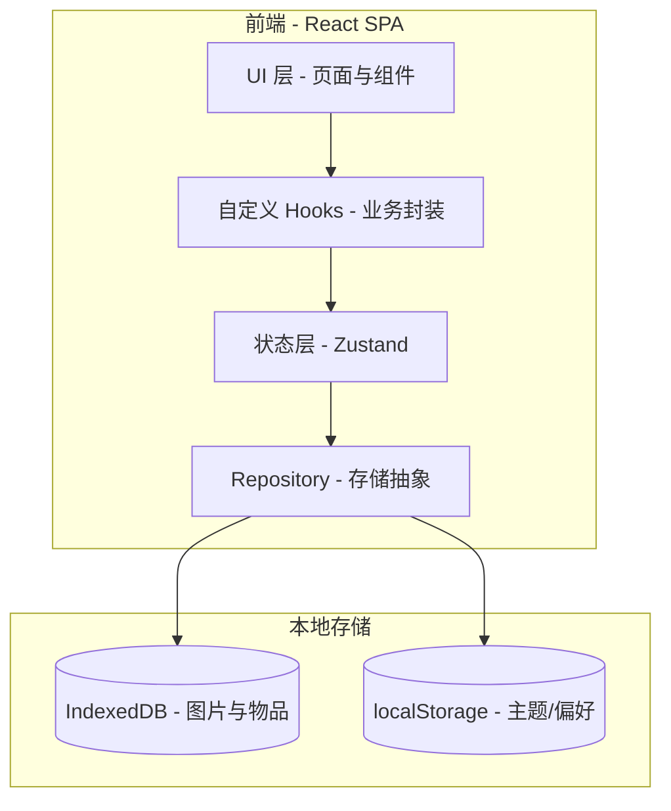
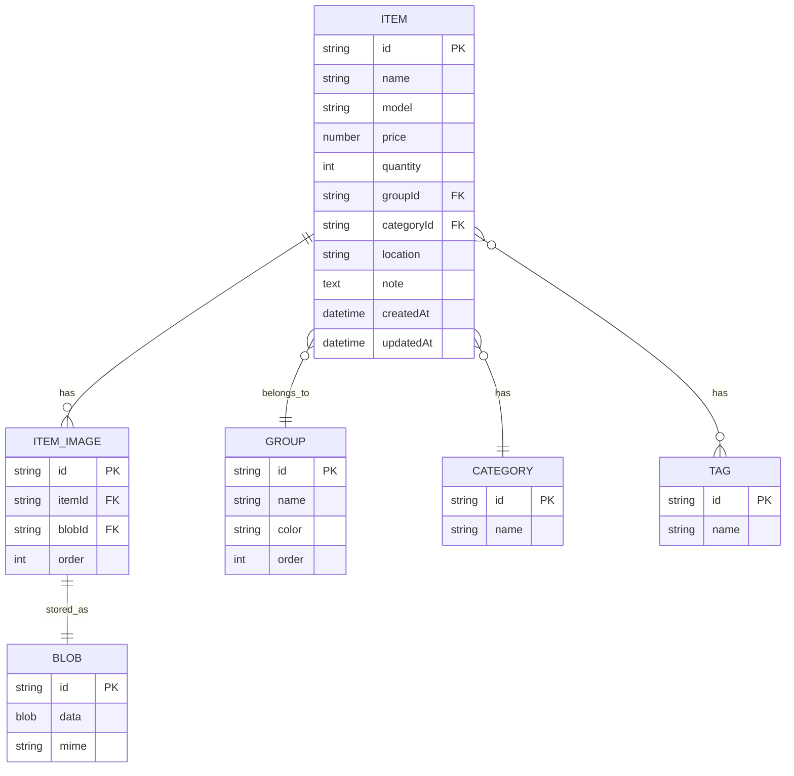

# 物品管理 Web 应用 - 技术架构

## 1. 架构设计



- 本地优先：所有数据保存在浏览器 IndexedDB，无需后端
- 单用户：不做登录、不做云同步（如后续需要可加 Supabase）

## 2. 技术描述

- **包管理**：pnpm（强制要求）
- **框架**：React 18 + Vite 5
- **语言**：JavaScript（不引入 TypeScript）
- **样式**：原生 CSS + CSS 变量（不引入 Tailwind，避免 AI 渐变默认风格）
- **图标**：`lucide-react`
- **状态管理**：`zustand`
- **路由**：`react-router-dom` v6
- **数据存储**：`idb` 库封装 IndexedDB
- **图片处理**：浏览器原生 `URL.createObjectURL` + `<canvas>` 压缩
- **Lint/Format**：ESLint（react 规则）+ Prettier
- **测试工具**（可选）：Vitest + Testing Library（首版可不引入）
- **无 TypeScript**：所有 `.js`/`.jsx`，`jsconfig.json` 提供路径别名

## 3. 路由定义

| 路由 | 用途 |
|------|------|
| `/` | 物品列表（默认页） |
| `/items/new` | 新增物品 |
| `/items/:id` | 物品详情 |
| `/items/:id/edit` | 编辑物品 |
| `/groups` | 分组管理 |
| `/categories` | 分类管理 |
| `/tags` | 标签管理 |
| `/stats` | 统计仪表板 |
| `/settings` | 设置 |

## 4. API 定义
不涉及后端 API。Repository 层负责 IndexedDB CRUD，方法签名示例（JS）：

```js
// itemsRepo
listItems(filter) -> Promise<Item[]>
getItem(id) -> Promise<Item>
createItem(data) -> Promise<string> // 返回 id
updateItem(id, patch) -> Promise<void>
deleteItem(id) -> Promise<void>
bulkImport(items) -> Promise<void>
exportAll() -> Promise<string> // JSON string

// imagesRepo
putImage(blob) -> Promise<string> // 返回 id
getImage(id) -> Promise<Blob>
deleteImage(id) -> Promise<void>
```

## 5. 服务器架构
无服务器。所有逻辑在浏览器端。

## 6. 数据模型

### 6.1 数据模型定义



### 6.2 数据定义（IndexedDB 初始化）

```js
// 数据库名：wist-db，版本 1
// Object Stores：
//   items       keyPath: id; 索引: name, groupId, categoryId, createdAt
//   images      keyPath: id; 索引: itemId
//   blobs       keyPath: id
//   groups      keyPath: id; 索引: name
//   categories  keyPath: id; 索引: name
//   tags        keyPath: id; 索引: name
```

## 7. 关键工程决策

- **不用 TypeScript**：仅 `.jsx`/`.js`，开启 Vite 的 SWC 编译
- **不用 Tailwind/UI 库**：手写 CSS，避免默认 AI 视觉（渐变、圆角大、彩色）
- **不引入图表库**：统计页用纯 SVG 绘制饼图与条形图
- **图片压缩**：上传时使用 canvas 压缩到最长边 1600px，质量 0.82
- **可访问性**：所有交互组件具备 ARIA 标签，键盘可达
- **性能**：列表使用虚拟化（`@tanstack/react-virtual` 或自实现简单虚拟滚动）
- **PWA**（可选）：不强制首版支持离线；如需可在第二轮加入 service worker
