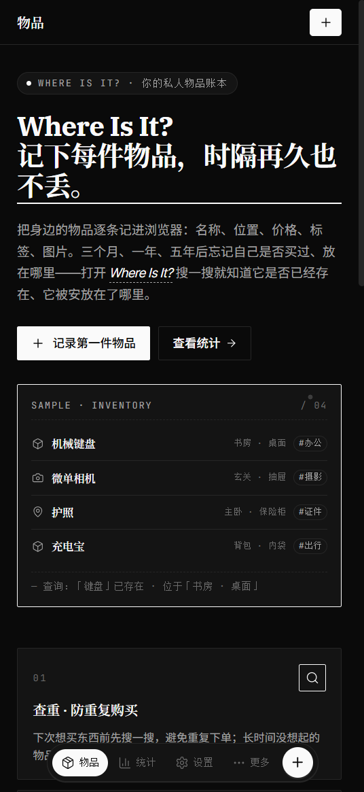

# Where Is It?

**A local-first, privacy-friendly inventory app — note where every belonging lives and still find it three years later.**

🌐 English · **[简体中文](README.md)**

[](#license)
[](https://react.dev)
[](https://vitejs.dev)
[](https://developer.mozilla.org/docs/Web/API/IndexedDB_API)
[](#philosophy)

---

## Table of Contents

- [Features](#features)
- [Philosophy](#philosophy)
- [Screenshots](#screenshots)
- [Quick Start](#quick-start)
- [User Guide](#user-guide)
- [Tech Stack](#tech-stack)
- [Project Structure](#project-structure)
- [Storage & Backup](#storage--backup)
- [Design Principles](#design-principles)
- [Accessibility & Performance](#accessibility--performance)
- [Internationalization](#internationalization)
- [Roadmap](#roadmap)
- [Contributing](#contributing)
- [License](#license)

---

## Features

- **Full-field item management** — name, model, price, quantity, location, notes, tags, photos (up to 5)
- **Three-dimensional organization** — Groups / Categories / Tags are decoupled; cross-filter at will
- **Frequent locations library** — maintain a standalone list (study / entryway / drawer…); deletion never touches historical `location` text on items
- **Local full-text search** — millisecond matching of name, model, tags, location; input uses `useDeferredValue` for debounce
- **Multi-select filters + sorting** — by added time / price / quantity / name; group drawer for quick switching
- **Local image compression** — Canvas downscales to 1600px / quality 0.82; stored as Blob in IndexedDB
- **Lightweight stats dashboard** — totals, total value, low-stock alerts, hand-rolled SVG distributions by category / tag
- **Three-state theme** — light / dark / follow system; CSS-variable driven, no flash on reload
- **Bilingual UI** — minimal in-house i18n (zh / en), no `react-i18next`
- **Responsive first** — mobile 375px single column → desktop ≥1024px multi-column grid; sidebar / bottom bar adapts
- **Local-first** — everything in browser IndexedDB, zero network requests
- **No accounts / No backend / No tracking** — open to use, close to leave
- **Import / export** — JSON backups (with images as base64), format-versioned with chained migration

---

## Philosophy

> "Three months, one year, five years from now — will you still remember what you bought and where it lives?"

Record every belonging in your browser: name, location, price, tags, photos. Next time you need to find something — open **Where Is It?** and a single search tells you whether it still exists and where it lives. Before pulling the trigger on a new purchase, search first and avoid duplicates.

It's not a to-do list. It's not an asset manager. It's not a cloud-synced note app. Its single ambition is: **make you remember anything you've forgotten — in three seconds.**

To serve that ambition, we said no to:

- Account systems (no one wants to sign up just to find a screwdriver)
- Cloud sync (your data is yours, not the server's)
- Every AI gradient, every pink-blue rounded card (you're opening a tool, not Instagram)

---

## Screenshots

When you first open the app with no items yet, an onboarding home page introduces the product and its key capabilities:


Responsive layout on mobile: the desktop sidebar collapses into a bottom navigation bar, with secondary entries folded into a "More" menu:



> More screenshots (items list / detail / stats / settings, etc.) will be added to `docs/imgs/`.

---

## Quick Start

Requires **Node.js ≥ 18**. `pnpm` is recommended; `npm` and `yarn` work too.

```bash
# Clone the repo
git clone https://github.com/EndThemex/where-is-it.git
cd where-is-it

# Install dependencies
pnpm install          # or npm install / yarn install

# Start dev server (default http://localhost:5173)
pnpm dev

# Production build
pnpm build

# Preview the production bundle locally
pnpm preview
```

The production output lives in `dist/` and can be deployed to any static host (GitHub Pages / Vercel / Netlify / Cloudflare Pages…).

---

## User Guide

| Scenario | Route |
| --- | --- |
| Record your first item | Home → "Record first item" |
| Browse all items | `/` (home) |
| Create / edit an item | `/items/new` · `/items/:id/edit` |
| Item detail | `/items/:id` |
| Manage groups | `/groups` |
| Manage categories | `/categories` |
| Manage tags | `/tags` |
| Manage frequent locations | `/locations` |
| Stats dashboard | `/stats` |
| Theme / language / data backup | `/settings` |

**Home convention**: when `items.length === 0`, render the onboarding `HomePage`. Once any data exists, fall back to `ItemsListPage` — **no route redirect** — to preserve filter state.

---

## Tech Stack

| Category | Choice |
| --- | --- |
| Framework | React 18 + React Router 6 (HashRouter) |
| Build | Vite 5 + `@vitejs/plugin-react-swc` |
| State | Zustand (catalog / prefs / theme / locale stores) |
| Persistence | IndexedDB (`idb` wrapper — see [src/lib/db.js](src/lib/db.js)) |
| Prefs / theme | `localStorage` (`wii.prefs` / `wii.theme` / `wii.locale`) |
| Icons | lucide-react (uniform `strokeWidth={1.5}`) |
| Styling | Plain CSS + CSS variables (no UI framework, no Tailwind) |
| Path alias | `@/*` → `src/*` (jsconfig.json) |

> **Why no TypeScript / Tailwind / chart library?**
> Deliberately minimal: the codebase hasn't hit the inflection point that justifies a type system and component lib — types would slow down iteration; Tailwind's defaults (gradients, large radii, color) clash with our "restrained, contrasted, black-and-white" design language; the stats page charts are pure SVG, sparing us ~100KB of chart library weight.

---

## Project Structure

```
src/
├── components/        # Shared UI (AppShell, MultiSelect, Thumb, Carousel, Drawer, Empty)
├── pages/             # Route-level pages (home / list / detail / edit / manage / stats / settings)
├── store/             # Zustand stores (catalog / prefs / theme / locale)
├── lib/               # Utilities and persistence (db / image / url / prefs / repos / blobCache / id)
├── hooks/             # Custom hooks (useBlobURL, etc.)
├── i18n/              # Minimal in-house dictionary (zh / en) + placeholder substitution
├── styles/            # Global styles + design tokens (CSS variables)
├── App.jsx            # Route table + Suspense (data pages lazy-loaded)
└── main.jsx           # Entry (HashRouter + anti-flash theme inline script)
```

---

## Storage & Backup

All data is written to browser IndexedDB — no cloud, no uploads, no network. Key object stores:

| Store | Contents | Indexes |
| --- | --- | --- |
| `items` | Item master data | `name` / `groupId` / `categoryId` / `createdAt` |
| `images` | Item-to-image relations | `itemId` |
| `blobs` | Image binaries (Blob) | — |
| `groups` | Groups (with default category binding) | `name` |
| `categories` | Categories (decoupled from groups) | `name` |
| `tags` | Tags | `name` |
| `locations` | Frequent locations (not bound to items) | `name` |

**Item fields**: `{ id, name, model, price, quantity, location, note, groupId, categoryId, tagIds[], imageIds[], createdAt, updatedAt }`

### Backup & Migration

In **Settings → Data**, export a JSON backup (with images serialized as base64) in one click. Each backup carries a `formatVersion` and is automatically migrated on import (v1 → v2 → v3 …).

> Clearing browser site data deletes everything above. **Export backups as needed** — the price of local-first.

---

## Design Principles

> See [`.trae/documents/prd.md`](.trae/documents/prd.md) and [`Agent.md`](Agent.md).

1. **Palette**: pure black `#0A0A0A` / pure white `#FAFAFA` + neutral grays + single warning hue (amber `#A16207` / dark `#D4A373`). **No purple / blue / pink gradients.**
2. **Shape**: square or tiny radius (`--radius: 2px`, occasionally 4px). **No big rounded cards, no heavy shadows.**
3. **Type**: headings `IBM Plex Serif` / `Noto Serif SC`; body `Inter Tight` / `Noto Sans SC`; digits & code `JetBrains Mono`.
4. **Icons**: linear, uniform `strokeWidth={1.5}`.
5. **Transitions**: only color & background `200ms ease`, no gradients, no shadows.
6. **Responsive**: mobile-first (default 375px), upgraded to multi-column grid at ≥1024px.
7. **Tap targets**: all clickable areas ≥ 44×44px.

---

## Accessibility & Performance

- All icon buttons carry `aria-label`; placeholder images use `alt=""` to keep screen readers clean
- Search input uses `useDeferredValue` to avoid recomputing filters on every keystroke
- List items wrapped in `memo()`; image `useBlobURL` hook strictly cleans up to prevent leaks
- Batch DB reads: `db.transaction()` + parallel `store.get()` instead of N× `await getDB()`
- Data pages are all `lazy()` + `Suspense`, minimizing first-paint JS payload
- Anti-flash theme: inline script before CSS / JS reads `localStorage` and sets `data-theme`

---

## Internationalization

UI strings live in [`src/i18n/zh.js`](src/i18n/zh.js) and [`src/i18n/en.js`](src/i18n/en.js), consumed via the `useT()` hook in [`src/i18n/index.js`](src/i18n/index.js).

- Placeholder syntax: `{name}` — missing vars are preserved verbatim
- Dictionary layered: `common.*` / `nav.*` / `home.*` / `items.*` / `settings.*`
- Missing keys fall back to the fallback locale (zh), then to the key itself (so unfinished translations are easy to spot)
- Browser language sniff: `navigator.language.startsWith('zh') ? 'zh' : 'en'`
- Dates formatted with `Intl.DateTimeFormat(lang, ...)` — layout follows the locale

> **User data is never translated** (item names, tags, group names) — that's content the user entered.

---

## Roadmap

- [x] Import / export (JSON) — shipped in v0.1
- [x] Three-state theme + system follow — shipped in v0.1
- [x] Frequent locations library (decoupled from items) — shipped in v0.1
- [x] Bilingual UI scaffold — shipped in v0.1
- [ ] PWA — installable, Service Worker offline launch
- [ ] Barcode / QR code scanning for entry
- [ ] Optional cloud sync (CRDT / WebDAV)
- [ ] Upgrade full-text search to FlexSearch / MiniSearch
- [ ] List virtualization (`@tanstack/react-virtual`)

---

## Contributing

Issues and PRs are welcome. Keep the code style consistent with the existing project:

- `pnpm build` must exit 0 before submitting
- Smoke-test on desktop (≥1024) and mobile (375)
- Smoke-test both light and dark themes
- Don't introduce new dependencies, new UI frameworks, or new gradients — **open an Issue first**

Full conventions in [`Agent.md`](Agent.md).

---

## License

[MIT](LICENSE) © 2026 [EndThemex](https://github.com/EndThemex)