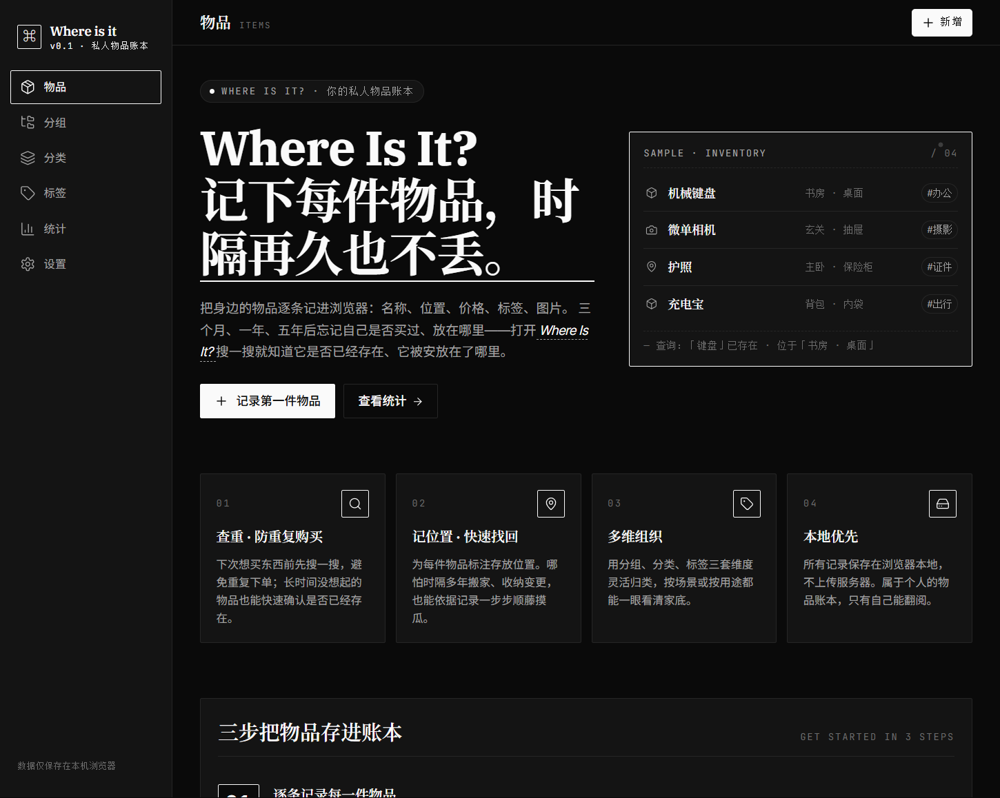

# Where is it

> A local-first, privacy-friendly inventory app for tracking where your belongings live.
> 数据只保存在你的浏览器里，不上云、不上传。

🌐 **[English](README.en.md)** · 简体中文

## ✨ 特性

- 📦 **物品管理**：名称、型号、位置、标签、价格、数量、备注、图片
- 🗂 **分组 / 分类 / 标签**：三维度组织你的物品
- 🔍 **搜索 + 多选筛选**：本地全文检索，毫秒级响应
- 📊 **统计页**：一眼看清单品结构
- 🌗 **明 / 暗主题**：跟随系统或手动切换
- 📱 **响应式布局**：桌面侧栏 + 移动底栏（次要入口折叠进「更多」下拉）
- 🔒 **Local-first**：全部数据写入浏览器 IndexedDB，**零网络请求**
- 💾 **零账号 / 零后端 / 零追踪**：打开即用，关闭即走

## 📸 截图

首次打开应用时，呈现一张说明站点身份与特点的引导首页：



> 更多截图（物品列表 / 详情 / 统计 等）将在 `docs/imgs/` 持续补充。

## 🚀 快速开始

需要 Node.js ≥ 18。

```bash
# 安装依赖
pnpm install          # 或 npm install / yarn install

# 启动开发服务器
pnpm dev              # 默认 http://localhost:5173

# 生产构建
pnpm build

# 本地预览生产产物
pnpm preview
```

## 🧱 技术栈

| 类别   | 选型                                |
| ------ | ----------------------------------- |
| 框架   | React 18 + React Router 6           |
| 构建   | Vite 5 + `@vitejs/plugin-react-swc` |
| 状态   | Zustand                             |
| 持久化 | IndexedDB（封装在 `src/lib/db.js`） |
| 图标   | lucide-react                        |
| 样式   | 原生 CSS + CSS 变量（无 UI 框架）   |

## 📁 项目结构

```
src/
├── components/      # 通用 UI（AppShell、MultiSelect、Thumb…）
├── pages/           # 路由级页面（物品列表 / 详情 / 编辑 / 管理…）
├── store/           # Zustand store（目录数据 / 偏好 / 主题）
├── lib/             # 工具与持久化（db、image、url、prefs…）
├── hooks/           # 自定义 hooks
├── styles/          # 全局样式与设计令牌
├── App.jsx          # 路由表 + Suspense
└── main.jsx         # 入口
```

## 🗃 数据存储

所有数据写入浏览器 IndexedDB（数据库名见 `src/lib/db.js`），关键对象库：

- `items`：物品主数据
- `groups` / `categories` / `tags`：分组 / 分类 / 标签
- `images`：图片二进制（以 Blob 存储，避免 base64 膨胀）

> ⚠️ 清除浏览器站点数据会一并删除以上内容。请按需自行导出备份（导出功能见路线图）。

## 🧭 路线图

- [ ] 数据导入 / 导出（JSON）
- [ ] PWA：可安装、离线启动
- [ ] 多语言（i18n）
- [ ] 条码 / 二维码扫描录入
- [ ] 可选云同步（CRDT / WebDAV）

## 🤝 贡献

欢迎 Issue 与 PR。请保持代码风格与现有项目一致（提交前 `pnpm build` 通过）。

## 📄 许可证

[MIT](LICENSE) © 2026 [EndThemex](https://github.com/EndThemex)
